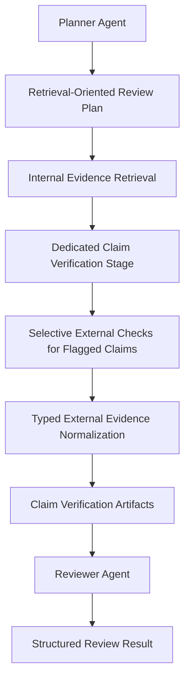

# Technical Architecture Document
## Academic Paper Analyzer

**System Classification:** Stateful, Evidence-Grounded, Claim-Centric, Tool-Augmented Academic Paper Due-Diligence System

---

## 1. Executive Summary & System Objectives

Academic Paper Analyzer is an **agentic, asynchronous, multimodal academic paper due-diligence system** designed to transform a static PDF into a durable, inspectable verification workflow.

The foundational runtime architecture remains intact:

- FastAPI handles ingress and polling.
- Celery executes the long-running workflow asynchronously.
- PostgreSQL stores transactional state.
- pgvector stores retrieval memory.
- Streamlit exposes progress and results.
- MCP isolates tool execution from reasoning logic.

What has changed is the **logical center of gravity** of the system.

The current implementation is no longer best described as only a review-oriented multimodal pipeline. It is organized around a claim-centric due-diligence model that:

1. parse the paper into multimodal artifacts,
2. retrieve auditable evidence objects,
3. verify claims explicitly against internal evidence,
4. selectively augment unresolved claims with external tools,
5. normalize external results into typed evidence records,
6. preserve both low-level claim audit artifacts and high-level synthesis,
7. benchmark the whole stack at claim level.

Architecturally, that shift inserts an explicit verification layer between retrieval and final synthesis. The system is therefore not a single synchronous LLM call hidden behind an upload form. It is deliberately decomposed into:

- ingress and task creation,
- durable workflow state,
- multimodal parsing and retrieval memory,
- planning and claim extraction,
- explicit claim verification,
- selective external verification,
- schema-constrained report synthesis,
- benchmark execution,
- and UI-level explainability.

### 1.1 Primary Objectives

| Objective | Architectural Interpretation |
| --- | --- |
| Evidence-grounded paper evaluation | Major conclusions should be traceable to retrieved internal passages, visual anchors, or normalized external evidence |
| Claim-centric auditability | Important judgments should exist as explicit claim verification objects, not only as prose paragraphs |
| Decoupled long-running execution | Parsing, embedding, retrieval, verification, and synthesis must not block the API request/response path |
| Multimodal fidelity | Figures and tables must remain attached to nearby semantics rather than being treated as detached binary assets |
| Conservative tool augmentation | External checks should run only when justified and should preserve uncertainty when evidence is weak |
| Typed evidence normalization | External tool results should be normalized into stable contracts rather than treated as ad hoc text blobs |
| Benchmarkability | Retrieval quality, verdict behavior, tool routing, and latency should be measurable with repeatable dataset and strategy interfaces |
| Interview-grade architecture clarity | The repository should demonstrate durable state, schema discipline, observability, idempotency, and clear failure boundaries |

### 1.2 System-Level Design Position

At a high level, the platform now performs the following sequence:

1. Accept a PDF upload through FastAPI.
2. Persist the document and enqueue a review task.
3. Parse the PDF into text blocks, visual blocks, metadata, and document-level text.
4. Split the parsed document into retrieval chunks while preserving visual anchors.
5. Embed and persist those chunks in pgvector-backed storage.
6. Use a Planner Agent to produce retrieval-oriented review intent and claim candidates.
7. Retrieve rich evidence objects from internal document memory.
8. Run a dedicated `CLAIM_VERIFICATION` stage over candidate claims.
9. Optionally augment unresolved claims with deterministic, claim-scoped external checks.
10. Normalize external outputs into typed evidence records and merge them conservatively.
11. Feed claim-verification artifacts into the Reviewer Agent for higher-level synthesis.
12. Persist both the low-level claim audit trail and the high-level review result in `result_json`.
13. Surface state, evidence, and verdict lineage through Streamlit.
14. Reuse the same parsing/retrieval/verifier stack in the benchmark runner.

The important change is that the reviewer is no longer the sole locus of judgment. A first-class verification layer now sits between retrieval and synthesis.

---

## 2. High-Level Distributed Architecture

The current implementation is a **locally deployable distributed system** built from loosely coupled runtime roles:

- **FastAPI** as ingress and polling boundary
- **Celery + Redis** as the asynchronous execution fabric
- **PostgreSQL + pgvector** as transactional store plus retrieval substrate
- **Streamlit** as the human-facing operations and inspection console
- **MCP over stdio** as the tool-execution boundary
- **Benchmark runner + curated dataset** as an offline evaluation surface over the same core components

### 2.1 Topology Overview

```mermaid
flowchart LR
    UI[Streamlit UI] -->|POST /documents| API[FastAPI]
    UI -->|POST /reviews| API
    UI -->|GET /reviews/{task_id}| API

    API --> DB[(PostgreSQL + pgvector)]
    API -->|delay(task_id)| CELERY[Celery Worker]
    CELERY --> REDIS[(Redis broker/backend)]
    CELERY --> DB
    CELERY --> OPENAI[OpenAI Responses API]
    CELERY --> MCP[MCP stdio tool server]

    MCP --> GH[GitHub REST API]
    MCP --> SS[Semantic Scholar API]
    MCP --> AX[arXiv API]
    MCP --> PY[Python subprocess boundary]

    BENCH[Benchmark Runner] --> DATA[Curated JSONL dataset]
    BENCH --> PDFS[Materialized PDF fixtures]
    BENCH --> OPENAI
    BENCH --> MCP
```

### 2.2 Role of Each Runtime

| Component | Responsibility | Notable Implementation Detail |
| --- | --- | --- |
| FastAPI | Thin API boundary for upload, task creation, polling, and evidence inspection | Async routes wrap synchronous SQLAlchemy sessions and avoid heavy work in-request |
| Celery Worker | Long-running workflow executor | Drives the durable FSM through parsing, vectorizing, planning, retrieval, claim verification, and reporting |
| Redis | Broker and result backend | Supports task dispatch and retry coordination |
| PostgreSQL | Durable system-of-record | Stores documents, review tasks, evidence rows, JSON results, and lifecycle timestamps |
| pgvector | Retrieval substrate | Stores 1536-dimensional embeddings on `vector_chunks.embedding` |
| Streamlit | Human-facing orchestration and explainability surface | Polls task status and renders claim-level results, evidence, and external-check details |
| MCP Server | Tool execution boundary | Isolates network and execution side effects from agent business logic |
| Benchmark Runner | Offline evaluation driver | Reuses parser, chunker, embedder, retriever, and verifier against labeled claim datasets |

### 2.3 Request-to-Completion Sequence

1. `POST /api/v1/documents`
   - Stores the uploaded PDF under `uploads/`.
   - Creates a `documents` row with status `UPLOADED`.

2. `POST /api/v1/reviews`
   - Performs a pre-flight OpenAI API key check.
   - Creates a `review_tasks` row with status `PENDING`.
   - Enqueues `run_review_task.delay(task_id)`.

3. Celery Worker
   - Advances the FSM from parsing through reporting.
   - Persists state after each major stage transition.
   - Persists low-level evidence rows plus final `result_json`.

4. `GET /api/v1/reviews/{task_id}`
   - Returns task status, retry count, timestamps, failure reason, and final structured result payload.

5. `GET /api/v1/reviews/{task_id}/evidences`
   - Returns persisted evidence rows for task-level lineage inspection.

6. Streamlit
   - Polls until terminal status.
   - Renders claim verifications, evidence quotes, external checks, typed external evidence, and synthesized review output.

### 2.4 Deployment Character

The codebase is optimized for a **single-node local deployment topology**:

- PostgreSQL defaults to `localhost:5432`
- Redis defaults to `localhost:6379`
- Celery and FastAPI are launched from the same project root
- MCP tools run as a local stdio child process

This is a deployment choice, not an architectural limitation. The important seams are already present:

- isolated worker role,
- database-backed workflow memory,
- explicit tool boundary,
- schema-based outputs,
- and benchmark execution decoupled from the user-facing app.

### 2.5 Architectural Evolution

The original runtime topology is still correct, but the logical pipeline has changed.

Previously, the dominant architecture was:

- Planner -> Retriever -> Reviewer

The current implementation is more accurately described as:

- Planner -> Retriever -> Claim Verifier -> Reviewer

That evolution is not a cosmetic refactor. It reassigns where critical judgments are made:

- retrieval remains responsible for evidence recall,
- claim verification now owns explicit claim-level verdicts,
- reviewer synthesis now operates downstream of those verification artifacts.

---

## 3. Advanced Context Management, Memory, and Workflow State

This section remains the architectural core of the system.

The pipeline simultaneously maintains:

1. **working memory** inside active reasoning loops,
2. **persistent memory** across asynchronous boundaries,
3. **cross-modal bindings** between text and visuals,
4. **verification memory** in the form of claim-verification artifacts that persist beyond one prompt.

### 3.1 Working Memory: Prompt State, Claim State, and Tool State

The active reasoning surfaces are no longer limited to one review prompt. The worker and agents now construct several distinct working-memory artifacts.

#### Core Working-Memory Artifacts

| Artifact | Scope | Purpose |
| --- | --- | --- |
| `review_plan` | Planning and retrieval | Encodes focus areas, claim-oriented queries, rationale, and priorities |
| `claim_candidates` | Claim verification stage | Provides the scoped set of claims to verify, with source and aspect metadata |
| `evidences` | Retrieval and verification | Holds rich internal evidence objects, including text and provenance |
| `claim_verifications` | Verification and reporting | Preserves structured per-claim verdicts before report synthesis |
| `content` blocks | Current model call | Mixes `input_text` with `input_image` blocks for multimodal reasoning |
| `previous_response_id` | Reviewer tool loop | Allows the final structured-output call to continue the same reasoning thread |
| `tool_outputs` | Tool-augmented reasoning | Holds structured `function_call_output` messages fed back into the model |
| `system_prompt` | Agent session | Encodes evidence discipline, tool policy, and schema expectations |

#### Multimodal Working Memory Construction

The reviewer still constructs multimodal content blocks with `_build_multimodal_user_content(...)`, which:

- starts from a textual review payload,
- resolves local `linked_image_path` values,
- base64-encodes images,
- injects them as separate `input_image` blocks in the model request.

Conceptually:

```python
[
    {"role": "system", "content": system_prompt},
    {
        "role": "user",
        "content": [
            {"type": "input_text", "text": review_prompt},
            {"type": "input_image", "image_url": "data:image/png;base64,..."},
            {"type": "input_image", "image_url": "data:image/png;base64,..."},
        ],
    },
]
```

That remains architecturally significant because the system does not merely store images. It **replays them into the active model context** when relevant evidence contains linked visual anchors.

#### Claim-State Working Memory

The new claim verifier introduces an additional class of ephemeral memory:

- planner-derived or fallback claim candidates,
- candidate-scoped internal evidence sets,
- per-claim external-tool requests,
- normalized external evidence records,
- and final merged claim-verification objects.

This is important because the verification layer operates as a **claim-by-claim reasoning loop**, not a single monolithic review prompt.

#### Tool-Trajectory Memory

The reviewer reasoning loop still uses a two-stage tool pattern:

1. initial model call with tool schemas,
2. tool execution,
3. replay of tool results as `function_call_output`,
4. final schema-constrained generation.

The verifier adds a second, more deterministic tool trajectory:

- claim flagged for external verification,
- deterministic tool selection,
- direct MCP call,
- typed normalization,
- conservative merge.

That means the architecture now contains **two different tool-use modes**:

- an LLM-mediated reviewer tool loop,
- and a deterministic verifier-side tool loop.

This split is intentional. The verifier path is more auditable and benchmarkable.

### 3.2 Persistent Memory: Durable FSM as System-Level Cognitive State

The real system memory is not the prompt. It is the database-backed workflow state.

The `review_tasks` table acts as a **durable finite-state machine** preserving global context across decoupled processes. This allows the thin API layer and the separate worker to behave like one coherent system.

#### Durable FSM States

| State | Meaning |
| --- | --- |
| `PENDING` | Accepted but not yet processed |
| `PARSING_DOC` | PDF structure, metadata, and multimodal extraction |
| `VECTORIZING` | Chunk generation, embedding, vector persistence |
| `AGENT_PLANNING` | Planner Agent generating retrieval intent and claim-oriented plan data |
| `EVIDENCE_RETRIEVAL` | Internal document evidence retrieval from pgvector-backed memory |
| `CLAIM_VERIFICATION` | Dedicated claim-by-claim internal-first verification and optional tool augmentation |
| `REPORT_GENERATING` | Reviewer Agent consuming verification artifacts and producing high-level synthesis |
| `COMPLETED` | Result JSON and evidence lineage persisted |
| `FAILED` | Terminal fault state |

#### Why `CLAIM_VERIFICATION` Was Introduced

This stage exists because the old architecture had a credibility gap:

- retrieval returned evidence-like objects,
- but many important judgments still happened implicitly inside review synthesis.

That made it harder to answer questions such as:

- Which claim was being evaluated?
- Which passage supported or weakened it?
- Was an external tool used because it was justified, or just because it was available?
- Did the final conclusion change because of external evidence?

The dedicated `CLAIM_VERIFICATION` stage fixes that by introducing:

- explicit claim intake,
- per-claim evidence retrieval,
- explicit per-claim verdict objects,
- internal versus final verdict distinction,
- and claim-scoped external verification traces.

Architecturally, this is the move that turns the system from a review-flavored synthesis pipeline into a more auditable due-diligence workflow.

#### Why Persistent Task State Still Matters

Without persistent state, an LLM pipeline is just a volatile function call.

With a durable FSM, the system gains:

- retry semantics,
- failure resumability,
- timestamped lifecycle control,
- UI-readable progress,
- and stage-aware observability across asynchronous boundaries.

#### Persistence Surfaces

At workflow level, the important persistence split is:

- artifact and parse/index lifecycle in `documents`,
- durable orchestration state and final result payloads in `review_tasks`,
- long-lived retrieval memory in `vector_chunks`,
- explicit internal evidence lineage in `evidences`.

A centralized persistence and data-model mapping is provided later in [Section 8.6](#86-persistence-and-data-model-mapping), where the relational surfaces and the JSON result contract are described together.

### 3.3 Cross-Modal Context Binding: Semantic Anchoring of Visual Evidence

The most architecturally interesting retrieval feature in the codebase is not just multimodal parsing, but **how visual evidence is bound back to text context**.

#### Parsing Stage

`rag/parser.py` uses Unstructured in `hi_res` mode with:

- `infer_table_structure=True`
- `extract_image_block_types=["Image", "Table"]`

The parser emits:

- ordered `text_blocks`,
- ordered `visual_blocks`,
- and per-document media directories under `media/documents/{document_id}/images`.

Each visual block carries fields such as:

- `order`,
- `category`,
- `image_path`,
- `caption_or_context`,
- and `anchor_text_order`.

#### Chunking Stage

`rag/chunker.py` constructs a token-level anchoring model:

1. every text block receives a token span,
2. page token windows are generated,
3. each visual anchor is mapped onto text span end positions,
4. distance to each chunk window is computed using half-open intervals `[start, end)`,
5. the closest chunk is selected,
6. if no valid anchor exists, a synthetic visual chunk is created.

Key implementation features include:

- half-open interval distance semantics,
- explicit treatment of missing anchors rather than defaulting them to `0`,
- and synthetic fallback chunks for orphan visuals.

This prevents a serious multimodal corruption pattern:

- image extracted correctly,
- text indexed correctly,
- but image semantically attached to the wrong chunk.

The `linked_image_path` field on vector chunks and evidence objects becomes the durable bridge between modalities.

### 3.4 Contextual Graceful Degradation

The current implementation continues to prefer **semantic degradation instead of hard failure propagation**.

That principle now applies to both internal and external verification:

- retrieval misses can yield `missing_evidence`,
- external tool routing can be skipped with an explicit reason,
- tool failures can produce normalized error/unresolved records,
- novelty-style claims can remain unresolved after external checks rather than being forced into a confident verdict.

This is not just exception handling. It is a context-management policy:

- infrastructure faults become explicit verification context,
- uncertainty is preserved structurally,
- and the verifier can represent “still unresolved” without collapsing the overall workflow.

---

## 4. Evidence and Retrieval Architecture

The retrieval layer has evolved from a thin chunk lookup mechanism into a more explicit **evidence contract** for downstream reasoning.

### 4.1 Parsing, Chunking, Embedding, and Storage

The internal evidence pipeline remains:

1. parse the PDF into structured multimodal blocks,
2. split the document into retrievable chunks,
3. embed each chunk,
4. persist chunks plus embeddings into `vector_chunks`,
5. run claim-focused or plan-focused similarity retrieval.

This layer is still backed by PostgreSQL + pgvector, but the architectural role of retrieval has changed:

- it is no longer only “context stuffing” for a reviewer,
- it is now the primary evidence substrate for explicit claim verification.

### 4.2 Evidence Contract Evolution

The retriever now emits richer evidence objects rather than thin metadata-only rows.

At minimum, the downstream consumer can access fields such as:

| Field | Role |
| --- | --- |
| `chunk_id` | Stable identity for one retrieved chunk |
| `chunk_text` | Actual passage text used for grounding |
| `page_number` | Page provenance for UI inspection and gold-span comparison |
| `section_name` | Local paper structure context |
| `score` | Retrieval score from the internal search path |
| `rank` | Relative ordering among retrieved candidates |
| `linked_image_path` | Visual linkage when a figure/table anchor is associated with the chunk |
| `claim` / `query` | The claim or retrieval query that triggered the evidence fetch |

This evolution matters architecturally for four reasons.

#### True Grounding

A downstream verifier or reviewer now sees the actual text passage, not only the chunk identifier.

#### Auditability

Claim-level verdicts can cite:

- exact quotes,
- page numbers,
- section names,
- and chunk identifiers.

#### Claim-to-Evidence Lineage

The system can now preserve a cleaner mapping between:

- claim candidate,
- retrieved evidence set,
- selected quotes,
- and final verdict.

#### Benchmarkability

The benchmark runner can evaluate claim-to-evidence behavior using:

- quotes,
- page numbers,
- and ranked evidence outputs.

Without the richer evidence contract, claim-level retrieval metrics would be much less meaningful.

### 4.3 Claim-Focused Retrieval Inputs

Another important architectural refinement is that the retriever no longer treats every arbitrary string in the plan payload as a search query.

The current direction is intentionally narrower:

- planner output is treated as a retrieval-oriented claim plan,
- retrieval favors `queries[].claim` and explicit search keywords,
- claim verification can issue targeted retrieval refreshes claim-by-claim.

This reduces noisy query expansion and makes it easier to interpret why a specific evidence set was returned.

### 4.4 Evidence Persistence and Lineage

The architecture now separates two related but different evidence surfaces:

| Surface | Meaning |
| --- | --- |
| `evidences` table | Persisted internal evidence lineage associated with a review task |
| `claim_verifications[].evidence_*` fields | Final claim-level evidence references used in structured verdicts |

This means the system has both:

- task-level evidence persistence,
- and claim-level evidence references embedded in the result contract.

That is a stronger audit model than a generic “retrieved context was present in the prompt.”

With that richer evidence contract in place, the rest of the architecture is best understood as a claim-centric verification pipeline rather than a reviewer-only prompt loop.

---

## 5. Claim-Centric Agentic Pipeline

The repository should no longer be described only as a `Planner -> Retriever -> Reviewer` pipeline.

The current implementation is better represented as a **claim-centric verification pipeline** in which review synthesis is downstream of structured claim adjudication.

### 5.1 Primary Logical Flow



### 5.2 Planner Agent

The Planner still produces a retrieval-oriented plan, but that plan now matters for more than final review prompting.

It includes:

- review aspects,
- claim-oriented queries,
- rationales,
- priorities,
- and search keywords.

Architecturally, the planner converts an open-ended paper review problem into a set of explicit retrieval and verification objectives.

### 5.3 Claim Extraction / Claim Intake

The verifier needs a practical source of candidate claims.

The current implementation follows a pragmatic fallback strategy:

1. prefer planner-derived claim/query structures,
2. fall back to lightweight parsed-text extraction when planner claims are missing,
3. preserve the `claim_source` field so the origin of each claim remains inspectable.

This is intentionally simple:

- no heavyweight NLP claim-mining subsystem,
- no hidden auto-ontology,
- just explicit claim intake with source provenance.

### 5.4 Dedicated Claim Verification Stage

`CLAIM_VERIFICATION` is now a real workflow stage, not a reviewer helper.

For each candidate claim, the verifier:

1. gathers the current evidence set,
2. optionally refreshes retrieval if the evidence is weak or sparse,
3. performs internal paper-evidence verification,
4. determines whether the claim still needs external verification,
5. optionally runs claim-scoped external checks,
6. normalizes external results into typed evidence records,
7. merges those results conservatively into the final claim object.

The outputs are persisted as structured `claim_verifications`.

That design ensures claim-level verification artifacts exist before review synthesis, rather than appearing only inside free-form review prose.

### 5.5 Why Claim Verification Is More Auditable Than Free-Form Review Synthesis

Free-form review prose is useful, but it is structurally weak for audit:

- claims can blur together,
- evidence provenance is implicit,
- and tool effects are hard to separate from model rhetoric.

Explicit claim verification is stronger because each object has:

- one claim text,
- one verdict,
- one confidence,
- explicit evidence references,
- explicit internal versus final verdict separation,
- explicit external-check metadata,
- and explicit reasons when uncertainty remains.

This is a more durable architecture for due diligence than relying on prose alone.

### 5.6 Reviewer Agent as Downstream Synthesizer

The Reviewer still matters, but its architectural role has narrowed and improved.

It now consumes:

- parsed document metadata,
- the review plan,
- internal evidence context,
- linked visual context,
- claim verifications,
- claim verification summary,
- and optionally tool outputs during its own reasoning loop.

Its job is now better framed as:

- synthesizing higher-level narrative,
- surfacing strengths and weaknesses,
- highlighting missing evidence,
- and packaging the due-diligence outcome for humans.

The reviewer is therefore downstream of claim verification rather than the primary judgment surface.

---

## 6. Model Context Protocol (MCP), Selective Tool Augmentation, and Typed External Evidence

The project continues to use **MCP over stdio** as the tool-execution boundary, but the semantics of tool usage are now much more disciplined.

### 6.1 Why MCP Still Matters

Without MCP, tools would be ordinary Python function calls tightly coupled to the agent modules.

With MCP, the architecture cleanly separates:

- agent cognition,
- tool schema declaration,
- tool process lifecycle,
- and side-effecting execution.

In this repository:

- `mcp_server.py` exposes tools with `FastMCP`,
- the reviewer and verifier act as MCP clients,
- and the model-facing tool contracts remain explicit.

This remains a practical hybrid:

- MCP for execution decoupling,
- local schemas and deterministic routing for contract stability.

### 6.2 Internal-First, Selective Tool-Augmented Verification

The verifier now follows a clear architectural philosophy:

1. use internal paper evidence first,
2. run external verification only when justified,
3. route to tools deterministically and claim-by-claim,
4. merge tool results conservatively,
5. preserve unresolved status when evidence remains weak.

That is intentionally different from a blanket “call tools for everything” strategy.

### 6.3 Claim-Scoped Tool Routing

The current deterministic routing policy is small and inspectable.

| Claim Type / External Reason | Tool | Purpose |
| --- | --- | --- |
| Explicit code-availability or repository claims | `check_github_repo` | Verify repository reachability and basic maintenance signals |
| Broader reproducibility support claims | `check_github_repo` | Improve or weaken confidence in code/repro support without over-claiming full reproducibility |
| Literature, citation, prior-work, or comparison claims | `search_semantic_scholar` | Check broader literature graph and citation-oriented context |
| Novelty or first-to claims | `search_arxiv` in addition to Semantic Scholar when justified | Provide lightweight prior-work or recent-preprint signal |
| Controlled computation | `execute_python_code` | Available in the tool catalog, but not a primary claim-verifier route today |

This routing policy is intentionally conservative:

- tools are chosen from explicit heuristics,
- the routing is claim-scoped,
- and no attempt is made to pretend the current stack can definitively settle all novelty claims.

### 6.4 Current Tool Catalog

| Tool | Domain | Primary Use in Current Architecture |
| --- | --- | --- |
| `search_arxiv` | External literature | Lightweight novelty or prior-work signal |
| `search_semantic_scholar` | External literature graph | Citation, comparison, and related-work checks |
| `check_github_repo` | Software artifact verification | Public code authenticity and basic repo health signals |
| `execute_python_code` | Controlled computation | Reserved for bounded verification tasks; not the dominant due-diligence path |

### 6.5 Typed External Evidence Normalization

One of the most important recent architectural changes is that external tool outputs are no longer treated as loose text blobs.

They are now normalized into a typed `ExternalEvidenceRecord`-style contract.

#### Why Typed External Evidence Exists

The normalization layer serves several purposes:

- decouple tool output format from downstream UI logic,
- distinguish internal evidence from external evidence cleanly,
- preserve which tool produced which signal,
- make verdict changes inspectable,
- and stabilize benchmark output contracts.

This is not product polish. It is a serious architecture improvement.

#### Generic External Evidence Record Shape

At a high level, each normalized external record carries fields such as:

| Field | Meaning |
| --- | --- |
| `tool_name` | Which external tool produced the record |
| `source_url` | Canonical source URL when available |
| `source_id` | Canonical source identifier when available |
| `match_status` | How confidently the result matches the scoped claim or query |
| `support_assessment` | Whether the record supports, weakens, or leaves unresolved the claim |
| `support_strength` | Conservative strength bucket |
| `confidence` | Match- or evidence-level confidence estimate |
| `summary` | Short normalized description of the evidence |

#### Tool-Specific Typed Payloads

The current implementation normalizes at least three payload families.

##### GitHub Evidence Payload

For reproducibility and code-availability checks, normalized fields include:

- `repo_url`
- `repo_exists`
- `owner`
- `name`
- `default_branch`
- `stars`
- `watchers`
- `forks`
- `has_readme`
- `has_releases`
- `last_updated`
- `pushed_at`
- `primary_language`
- `languages`
- `archived`
- `disabled`
- `open_issues_count`

##### Semantic Scholar Evidence Payload

For literature and citation checks, normalized fields include:

- `query`
- `matched_paper_title`
- `matched_authors`
- `year`
- `citation_count`
- `influential_citation_count`
- `venue`
- `source_url`
- `paper_id`
- `result_rank`
- `match_status`

##### arXiv Evidence Payload

For novelty-style and prior-work checks, normalized fields include:

- `query`
- `title`
- `authors`
- `published_date`
- `arxiv_id`
- `categories`
- `source_url`
- `result_rank`
- `match_status`

### 6.6 Internal Evidence Versus External Evidence

The architecture now keeps the two evidence classes clearly separate.

| Evidence Class | Role |
| --- | --- |
| Internal evidence | Retrieved chunks, quotes, pages, sections, and linked visuals from the paper itself |
| External evidence | Tool-derived records normalized into typed structures with explicit provenance |

This separation matters because internal paper evidence and external verification are answering different questions:

- internal evidence checks what the paper actually says and shows,
- external evidence checks what the broader scholarly or software ecosystem says about the claim.

### 6.7 `internal_verdict` Versus Final `verdict`

Another major architecture change is the explicit distinction between:

- `internal_verdict`
- final `verdict`

That distinction allows the system to answer questions such as:

- Was the claim already supported internally?
- Did external evidence merely reinforce the internal view?
- Did external evidence weaken it?
- Did the claim remain unresolved even after tools?

Those transitions are further described by fields such as:

- `external_resolution_status`
- `verdict_changed_by_external`
- `verdict_change_reason`

### 6.8 Conservative External Merge Logic

The current merge logic is intentionally conservative.

Examples:

- a reachable GitHub repository can move an explicit “code is publicly available” claim from unresolved to supported,
- a missing repository can weaken a strong reproducibility claim,
- ambiguous Semantic Scholar or arXiv matches should not confidently flip a novelty claim,
- weak tool evidence can leave the claim unresolved.

This is an architecture choice, not a missing feature:

- trustworthiness is prioritized over aggressive resolution,
- and unresolved remains a first-class outcome.

That conservative merge behavior is what allows the tool layer to strengthen auditability without turning the verifier into an overconfident autonomous research agent.

### 6.9 Quantitative Tool Outputs as Structured Signals

The typed normalization layer means the system no longer depends on prose parsing alone for external evidence.

For example:

- citation counts,
- influential citation counts,
- repository stars,
- and repository health signals

are all normalized into structured fields.

That improves:

- downstream UI stability,
- benchmark inspection,
- and the ability to reason about tool effects without brittle text scraping.

### 6.10 Operational Notes

Two operational details remain important:

1. the runtime environment must provide the `mcp` package,
2. tool-augmented paths depend on outbound access to the relevant external APIs.

Those are deployment realities, not conceptual architecture gaps.

---

## 7. Security, Isolation, and Boundary Honesty

The highest-risk surface in the platform remains `execute_python_code`, which can run LLM-generated code in a child process.

### 7.1 Execution Boundary

The tool does not use `exec()` inside the MCP server process.

Instead it:

1. writes code to a temporary `.py` file,
2. launches a separate Python subprocess,
3. captures stdout and stderr,
4. enforces a hard timeout,
5. deletes the temp file in a `finally` block.

That means the system has a meaningful process boundary around code execution.

### 7.2 Current Mitigation Model

| Risk | Current Mitigation | Effect |
| --- | --- | --- |
| Infinite loops | `timeout=10` and explicit timeout handling | Prevents unbounded execution time |
| File persistence | Ephemeral temp file + cleanup in `finally` | Minimizes disk residue |
| Parent-process contamination | Child subprocess boundary | Prevents direct corruption of MCP server interpreter state |
| Silent execution failure | stdout/stderr captured and returned | Makes failures reviewer-visible rather than silent |

### 7.3 Security Boundary Honesty

Precision matters here:

- this **is** a meaningful process boundary,
- but it is **not yet** equivalent to container-level, VM-level, seccomp, or full syscall-filter sandboxing.

What the current design guarantees:

- process isolation from the parent interpreter,
- temporal bounding,
- ephemeral file handling,
- graceful error propagation.

What it does not yet guarantee:

- strong resource quotas beyond time,
- filesystem jail semantics,
- network egress restrictions,
- kernel-level isolation.

Also note that the dedicated claim verifier does **not** depend on arbitrary code execution for its primary flow. The current due-diligence architecture is centered on retrieval, structured verification, and deterministic external tool routing, which keeps the highest-risk execution surface off the critical path.

---

## 8. Structured Output Contracts and Persistence

The system now has a broader and more explicit structured-output contract than the original review-only design.

### 8.1 Review Result Contract

The persisted `ReviewResultSchema` now supports both high-level synthesis and low-level claim audit artifacts.

Key top-level fields include:

| Field | Purpose |
| --- | --- |
| `summary` | High-level reviewer synthesis |
| `strengths` | Concrete positive findings |
| `weaknesses` | Concrete negative findings |
| `missing_evidence` | Claims or areas that could not be adequately supported |
| `questions_for_authors` | Clarifying questions that materially affect confidence |
| `code_reproducibility_check` | Human-readable synthesis of code/reproducibility signals |
| `claim_verifications` | Structured claim-level verification artifacts |
| `claim_verification_summary` | Stage-level instrumentation and summary counts |
| `external_references_checked` | Structured literature/reference artifacts surfaced by the reviewer |

This is a materially stronger contract than a report-only schema.

### 8.2 Claim Verification Contract

The `ClaimVerificationSchema` is now one of the most important result types in the repository.

It carries fields such as:

| Field Group | Representative Fields |
| --- | --- |
| Claim identity | `claim_text`, `claim_source`, `aspect` |
| Final judgment | `verdict`, `confidence` |
| Internal evidence lineage | `evidence_chunk_ids`, `evidence_quotes`, `page_numbers`, `section_names`, `linked_image_paths` |
| Internal-first verification state | `internal_verdict`, `internal_confidence` |
| External-check need | `needs_external_check`, `external_check_reason` |
| External execution trace | `external_verification_status`, `external_checks_run`, `external_source_urls` |
| Typed external evidence | `external_evidence_records` |
| Merge outcome | `external_resolution_status`, `verdict_changed_by_external`, `verdict_change_reason` |
| Timing / notes | `internal_latency_ms`, `external_latency_ms`, `notes` |

This gives the system an explicit low-level audit layer for each verified claim.

### 8.3 Typed External Evidence as Part of the Result Contract

The result contract does not merely say that external checks happened. It records their normalized outputs directly.

That means:

- UIs can render tool-specific evidence without re-parsing raw tool text,
- benchmarks can inspect tool usage and typed external evidence counts,
- and future downstream systems can consume stable evidence contracts rather than scraping prose.

### 8.4 Claim Verification Summary

The `claim_verification_summary` adds stage-level instrumentation such as:

- total claims,
- claims needing external check,
- claims with external checks run,
- total external checks,
- internal latency,
- external latency.

That is useful because the architecture now treats claim verification as its own measurable subsystem, not just a hidden subroutine of report generation.

### 8.5 External References as Reviewer-Normalized Artifacts

`external_references_checked` remains valuable because it bridges reviewer-used external signals back into a stable schema with fields such as:

- `title`
- `authors`
- `published_date`
- `summary`
- `citation_count`
- `influential_citation_count`

This is complementary to claim-level external evidence, not a replacement for it:

- `claim_verifications` capture claim-scoped due diligence,
- `external_references_checked` captures reviewer-visible literature artifacts.

### 8.6 Persistence and Data-Model Mapping

The current persistence model intentionally uses both relational and JSON surfaces. The table below centralizes where the important system state lives.

| Surface | Primary Contents | Architectural Role |
| --- | --- | --- |
| `documents` | Uploaded file location, document status, metadata references | Tracks the physical artifact and its parse/index lifecycle |
| `review_tasks.status` | Durable FSM state, retry count, timestamps, failure context | Acts as workflow control memory across API and worker boundaries |
| `review_tasks.result_json` | Final structured output contract | Stores synthesized review output plus claim-level audit artifacts in one durable payload |
| `result_json.claim_verifications` | Per-claim verdicts, evidence lineage, internal/final verdict state, external-check metadata | Serves as the current persisted claim-verification surface |
| `claim_verifications[].external_evidence_records` | Typed external evidence records embedded inside each claim object | Preserves tool-specific normalized evidence without requiring raw text reparsing |
| `vector_chunks` | Chunk text, embedding, page/section provenance, linked visual context | Provides the long-lived internal retrieval substrate |
| `evidences` | Task-linked evidence rows connecting claims/review context to retrieved chunks | Preserves explicit internal evidence lineage outside the final JSON payload |

This design keeps the core workflow state relational while allowing the richer claim-verification contract to evolve as structured JSON. The main current tradeoff is that claim verifications still live inside `result_json` rather than in a dedicated normalized relational table.

### 8.7 Why the Current Result Model Matters

Architecturally, the updated result schema now supports both:

1. **high-level synthesis for human consumers**
2. **low-level structured audit artifacts for verification, benchmarking, and UI inspection**

That combination allows one result contract to serve both human-facing review rendering and low-level verification inspection.

---

## 9. Idempotency, Consistency, and Concurrency

### 9.1 Idempotency

The worker is built around the assumption that retries will occur.

That is why idempotency is explicitly encoded into the workflow.

#### Vectorization Retry Hygiene

If a failure occurs during `VECTORIZING`, the worker cleans up existing vector chunks before retrying.

This prevents:

- duplicate chunk insertion,
- mixed-version embeddings,
- retrieval pollution,
- and downstream evidence inconsistency.

#### Claim Verification Re-Execution Safety

The new claim-verification stage is compatible with that model because its artifacts are:

- recomputed from persisted document state and retrieval memory,
- persisted as a fresh structured result segment,
- and not treated as append-only side effects.

This keeps the new stage aligned with the existing retry model instead of introducing stateful verification drift.

#### Fail-Fast Versus Retryable Faults

The worker still distinguishes between retryable and fatal faults:

| Failure Class | Behavior |
| --- | --- |
| `openai.AuthenticationError` | Immediate terminal failure |
| `openai.RateLimitError` with `insufficient_quota` | Immediate terminal failure |
| Generic stage exceptions | Rollback, retry count increment, and stage-aware backoff |

This distinction remains critical because configuration or quota failures should not be retried like transient transport issues.

### 9.2 ACID-Oriented Session Discipline

The SQLAlchemy session configuration still reflects an ACID-oriented approach:

- explicit transactions,
- `expire_on_commit=False`,
- request-scoped API sessions,
- worker-owned task sessions.

FastAPI and Celery do not share ambient mutable session state.

That reduces the risk of:

- dirty session reuse,
- stale cross-boundary object access,
- hidden transaction bleed-through.

### 9.3 Concurrency Model

The system handles concurrency by keeping heavyweight work out of the API path.

FastAPI remains responsible for:

- validating requests,
- persisting minimal initial state,
- enqueueing work,
- returning immediately.

Celery owns all expensive operations:

- PDF parsing,
- multimodal extraction,
- embedding,
- retrieval,
- claim verification,
- LLM reasoning,
- external tool access,
- report generation.

This preserves API responsiveness even while the worker is occupied with:

- long OpenAI calls,
- OCR-heavy document parsing,
- external API latency,
- or multimodal processing.

### 9.4 Backoff Strategy

Retries are still not uniform:

- `VECTORIZING` uses exponential backoff,
- other stages use simpler retry behavior.

That remains reasonable because vectorization is expensive and retrieval-sensitive.

### 9.5 Stage-Level Timing

The newer claim-verification architecture also introduces stage-level timing artifacts at the result level:

- aggregate internal verification latency,
- aggregate external verification latency,
- per-claim internal and external latency.

This is not a full tracing system, but it improves performance visibility without adding a separate metrics backend.

---

## 10. Benchmark and Evaluation Architecture

The repository now includes a serious evaluation surface under `benchmarks/`.

This is not a large-scale benchmark platform, but it is a meaningful architectural layer for claim-level comparison and regression checks.

### 10.1 Why a Benchmark Layer Exists

Without a benchmark layer, it is difficult to answer questions such as:

- Is claim verification better than free-form review generation alone?
- Does tool augmentation help on claims that actually need it?
- Is the system conservative enough on unresolved novelty claims?
- Are internal-only claims being handled differently from tool-needed claims?

The benchmark architecture exists to make those questions measurable, even if the current dataset is still small.

### 10.2 Dataset Schema Concepts

The benchmark dataset is JSONL and paper-centric.

Each record contains:

- `paper_id`
- `pdf_path`
- `focus_areas`
- `claims[]`

Each claim can carry:

| Field | Meaning |
| --- | --- |
| `claim_text` | The labeled claim to evaluate |
| `gold_label` | Expected verdict |
| `gold_evidence_spans` | Optional gold internal evidence spans |
| `gold_visual_evidence` | Optional visual evidence hints |
| `tool_needed` | Whether internal evidence is expected to be insufficient |
| `required_tool` | Which tool a strong strategy is expected to route to |
| `external_gold_expectation` | Expected effect of external evidence (`supports`, `weakens`, `unresolved`) |
| `gold_external_evidence_hints` | Optional notes about what external evidence should look like |

This schema is intentionally aligned with the current implementation:

- it is claim-centric,
- it supports both internal-only and tool-needed claims,
- and it does not pretend every claim has a clean single-source gold answer.

### 10.3 Strategy Variants

The benchmark runner currently supports multiple strategies:

| Strategy | Current Role |
| --- | --- |
| `direct_long_context` | Scaffold placeholder baseline |
| `vanilla_rag` | Deterministic scaffold baseline over claim-focused retrieval |
| `dedicated_claim_verifier` | Model-backed internal-only verifier |
| `tool_augmented_claim_verifier` | Dedicated verifier plus selective external checks |
| `current_pipeline` | Planner-informed pipeline plus dedicated verification |

It is important to be precise here:

- `direct_long_context` is still a placeholder, not a full implemented long-context verifier,
- `dedicated_claim_verifier` is the main implemented internal-only reference,
- `tool_augmented_claim_verifier` is the main implemented internal-plus-tools comparison point.

### 10.4 Metrics Surfaces

The benchmark layer currently includes metrics for:

| Metric Family | Current Examples |
| --- | --- |
| Retrieval | `retrieval_recall@k` |
| Verdict quality | `claim_verdict_accuracy` |
| Slice breakdown | `claim_subset_accuracy_summary` for internal-only vs tool-needed claims |
| Tool-needed dataset summary | `tool_needed_claim_summary` |
| Tool routing | `required_tool_usage_summary` |
| Tool-needed resolution behavior | `tool_needed_outcome_summary` |
| External-check behavior | `external_check_summary` |
| Performance | `latency_summary` |

This is a pragmatic v1 evaluation stack:

- not exhaustive,
- but sufficient to compare internal-only versus tool-augmented verification on a small labeled slice.

### 10.5 What the Benchmark Can and Cannot Prove

What it can support today:

- regression checks,
- qualitative strategy comparison,
- tool-routing sanity checks,
- evidence of architectural seriousness in interviews or design review.

What it cannot yet support:

- statistically broad claims about general academic-review performance,
- definitive novelty-verification accuracy at scale,
- robust large-sample measurement across domains and publishers.

That limitation is explicitly architectural, not hidden.

### 10.6 Credential and Runtime Realities

The benchmark layer reuses the production components.

That means:

- model-backed strategies require OpenAI credentials,
- tool-augmented strategies require network/tool access,
- and paper fixtures must exist locally or be materialized.

That is why the benchmark architecture includes both:

- checked-in annotations,
- and a helper for obtaining or copying PDF fixtures.

Those benchmark concerns connect directly back to the claim-verification architecture: the same explicit verdicts, evidence lineage, and typed external evidence records that make the runtime system inspectable also make the evaluation layer tractable.

---

## 11. Curated Tool-Needed Benchmark Slice

The benchmark layer now includes a checked-in curated slice under `benchmarks/data/`.

### 11.1 Why a Small Curated Slice Was Chosen

A small manually curated slice was chosen instead of a large noisy dataset because the current architectural goal is:

- credibility,
- inspectability,
- and regression usefulness.

The slice is intended to demonstrate:

- internal-only claims,
- tool-needed claims,
- expected tool routing,
- and conservative handling of unresolved cases.

That is more useful for the current maturity level than a larger but weakly annotated corpus.

### 11.2 Current Checked-In Slice

The current curated slice consists of:

- 3 papers,
- 13 annotated claims,
- 6 tool-needed claims.

It includes:

- internal-only claims verifiable from paper content,
- GitHub-needed claims for code/reproducibility support,
- literature-needed claims for novelty and state-of-the-art assertions.

### 11.3 Role of `tool_needed`, `required_tool`, and `external_gold_expectation`

These fields exist to make tool behavior inspectable rather than magical.

| Field | Architectural Purpose |
| --- | --- |
| `tool_needed` | Marks that internal evidence alone is not expected to be enough |
| `required_tool` | States which tool a strong tool-augmented strategy should route to |
| `external_gold_expectation` | States whether external evidence is expected to support, weaken, or still leave unresolved the claim |

This allows the benchmark to ask not only “was the final verdict right?” but also:

- was the tool routing appropriate,
- was tool augmentation actually invoked when useful,
- and did the system remain conservative when external evidence was weak.

### 11.4 Why the Slice Includes Ambiguity

Some claims are intentionally labeled as `needs_external_verification`.

This is important because a credible due-diligence benchmark should not only reward aggressive resolution. It should also reward:

- appropriate abstention,
- conservative novelty handling,
- and honest unresolved outcomes.

### 11.5 Fixture Materialization

The curated slice includes:

- a JSONL annotation file,
- a paper-source manifest,
- and a materialization helper.

The helper can:

- download public PDFs when stable URLs exist,
- copy known local fixtures when available,
- or tell the user which fixture must be placed manually.

This keeps the benchmark slice:

- repo-owned at the annotation level,
- but not dependent on checking large binary fixtures directly into the repository.

### 11.6 Limitations of the Curated Slice

The current slice has explicit limits:

- it is small,
- one fixture path may depend on local/manual placement if publisher access blocks automation,
- and most literature-needed claims should still be treated as difficult or partially unresolved.

That limitation is documented intentionally. The slice is for:

- regression testing,
- architectural comparison,
- and credible demonstration,

not for broad leaderboard-style claims.

---

## 12. Observability and Explainability

A strong system is not just correct; it is inspectable.

The current codebase has improved observability specifically around the new claim-centric architecture.

### 12.1 FSM-Level Observability

The Streamlit UI still polls task status and surfaces:

- current FSM stage,
- retry count,
- error messages,
- document/task identifiers,
- progress surfaces,
- terminal success or failure.

The addition of `CLAIM_VERIFICATION` makes the asynchronous workflow more legible because the user can now see that verification is a distinct stage rather than a hidden part of report generation.

### 12.2 Semantic Trace Surfaces

The project still does not persist a full distributed tracing stack or raw MCP frame history as a dedicated telemetry subsystem.

Instead, it exposes **semantic traces**:

- claim-level verdicts,
- evidence quotes,
- page numbers,
- external-check statuses,
- tools used,
- normalized external evidence summaries,
- verdict deltas and reasons,
- and final high-level review output.

This is still highly valuable because it answers **why** a conclusion was reached without exposing raw chain-of-thought.

### 12.3 Claim-Level Explainability in the UI

The Streamlit claim view now surfaces:

- claim text,
- final verdict,
- internal verdict,
- confidence,
- evidence quotes,
- pages and sections,
- linked visual evidence paths,
- external verification status,
- tools used,
- external check summary,
- typed external evidence records,
- and verdict change reason where applicable.

That is a major explainability improvement over a summary-only UI.

### 12.4 Why This Matters

This matters architecturally because it reduces black-box behavior.

A user can now inspect:

- what claim was evaluated,
- what internal passages were used,
- whether external checks ran,
- which tools were involved,
- whether tool evidence was decisive,
- and whether the final verdict changed because of external evidence.

That is much closer to a due-diligence console than to a summary-only chat interface.

### 12.5 Structured Internal Trace Artifacts

Internally, the system now maintains several structured trace-like artifacts:

- reviewer tool call outputs,
- claim external check records,
- typed external evidence records,
- claim verification summaries,
- and persisted evidence rows.

These are not full tracing spans, but they serve a similar architectural purpose:

- they make the system inspectable,
- and they make future tracing or analytics extensions easier.

---

## 13. Current Non-Goals and Architectural Boundaries

The current architecture is deliberately stronger than a summary-only system, but it still has clear boundaries. Those boundaries are part of the design, not hidden caveats.

| Boundary | Current Position |
| --- | --- |
| Novelty verification | Conservative and signal-oriented; not a full literature-graph proof system |
| Claim-verification persistence | Stored explicitly in `result_json`, but not yet normalized into a dedicated relational table |
| Literature matching | Useful for routing and weak challenge/support signals, but still conservative rather than authoritative |
| Benchmark scope | Curated v1 slice for regression checks and comparative evaluation, not a large-scale benchmark |
| Sandbox boundary | Meaningful process isolation with timeout and cleanup, but not a hardened container or kernel-level isolation environment |
| Traceability model | Strong semantic inspection surfaces, but not yet a full distributed tracing or telemetry stack |

These boundaries are important because they define the intended operating envelope of the current system:

- explicit due-diligence support rather than universal claim adjudication,
- selective tool augmentation rather than unrestricted autonomous research,
- and inspectable structured outputs rather than hidden reasoning.

---

## 14. Closing Assessment

Academic Paper Analyzer is more accurately understood as a **stateful, evidence-grounded, claim-centric academic paper due-diligence system** whose architecture intentionally combines:

- asynchronous workflow orchestration,
- durable state-machine memory,
- multimodal semantic anchoring,
- rich internal evidence contracts,
- explicit claim verification,
- selective external tool augmentation,
- typed external evidence normalization,
- schema-constrained outputs,
- benchmarkable evaluation surfaces,
- and human-readable explainability.

That combination is what makes the current architecture meaningfully stronger than a generic RAG summary pipeline:

- judgments are increasingly explicit,
- evidence lineage is inspectable,
- tool use is selective rather than indiscriminate,
- unresolved outcomes are representable,
- and the system can be evaluated at claim level.

From an engineering-review perspective, the important fact is that the repository now demonstrates not only multimodal retrieval and asynchronous orchestration, but also a more mature architecture for:

- auditable claim verification,
- controlled tool augmentation,
- typed evidence handling,
- and due-diligence-oriented outputs.

That is a materially stronger technical shape than “upload a PDF and get a summary.”
